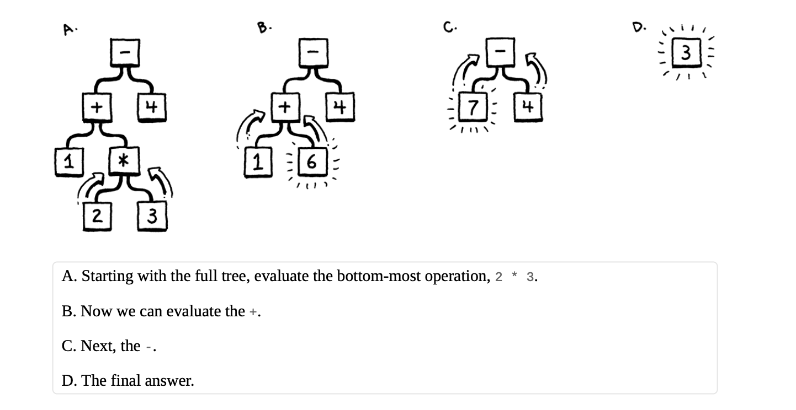

# Py-Lox

Lox Implementation as presented in the book, Crafting an Interpreter Implemented in Python

Compilation Steps
- **Lexxing (Scanning)**:
  In this step of the compilation process, We implement functionalities that takes in the source code string as input
  and breaks it into a sequence of tokens (Tokenization) present in the source code string, characters like whitespace and comment strings are completely ignore in this step, and to be useful, the actual values for tokens like numeric values are stored on the token object.

  Some tokens that represent punctuation are unit types, in the sense that a `.` is always a dot, but a number can be `1`, `2` or `23245`
  this value store is also applied to tokens that represent strings, along side storing the literal values for some tokens, the line
  where the token appear in the source code is stored on the token object, this helps with things like error reporting later in the compilation/interpretation phases.

  Example:
  ```pylox
  # Source Code: This line is a comment
  var name = "Brian Obot";
  print name;

  var age = 25;
  print age
  ```

  give this sample source code, which by the way is a valid syntax for the py-lox being built in the course of this course,
  when this code is passed to the lexxer, it reads the characters and produces a stream of token that matches the ones shown below

  ```
  Token(type=<TokenType.VAR: 37>, lexeme='var', literal=None, line=2)
  Token(type=<TokenType.IDENTIFIER: 20>, lexeme='name', literal=None, line=2)
  Token(type=<TokenType.EQUAL: 14>, lexeme='=', literal=None, line=2)
  Token(type=<TokenType.STRING: 21>, lexeme='Brian Obot', literal='Brian Obot', line=2)
  Token(type=<TokenType.SEMICOLON: 9>, lexeme=';', literal=None, line=2)
  Token(type=<TokenType.PRINT: 32>, lexeme='print', literal=None, line=3)
  Token(type=<TokenType.IDENTIFIER: 20>, lexeme='name', literal=None, line=3)
  Token(type=<TokenType.SEMICOLON: 9>, lexeme=';', literal=None, line=3)
  Token(type=<TokenType.VAR: 37>, lexeme='var', literal=None, line=5)
  Token(type=<TokenType.IDENTIFIER: 20>, lexeme='age', literal=None, line=5)
  Token(type=<TokenType.EQUAL: 14>, lexeme='=', literal=None, line=5)
  Token(type=<TokenType.NUMBER: 22>, lexeme='25', literal=25.0, line=5)
  Token(type=<TokenType.SEMICOLON: 9>, lexeme=';', literal=None, line=5)
  Token(type=<TokenType.PRINT: 32>, lexeme='print', literal=None, line=6)
  Token(type=<TokenType.IDENTIFIER: 20>, lexeme='age', literal=None, line=6)
  Token(type=<TokenType.EOF: 39>, lexeme='', literal=None, line=6)
  ```

  for the acute reader, you might notice an error with parsing print function, I have just temporarily given up and fixing that to maintain learning progress at all cost, i would definitely resolve that soon, <strikethrough>also the lexeme for the tokens are not correct<strikethrough>

- **Parsing**: This is the process of converting a sequence of tokens into a syntax tree. This stage involves reading in the token stream from the lexxing stage and building an internal representation of the expressions, usually called a Syntax Tree, it's important to understand that in the lexxing stage, the unit of grammar was each character, but in the parsing stage, the unit of grammar is the token and expressions, and each node in our Syntax tree would map to a
token or an expression.

Like the scanner the parser consumes a flat sequence, but unlike the scanner, the consumed items are tokens and not characters.

*Technically*, A parser is an implementation for a language grammar that checks where a input expression is valid or not as par the grammar of the language.

Before any parsing is done, it is helpful to have a good mental representation of code first,
take the code for example
```
1 + 2 * 3 - 4
```

Looking at it, we know that following the precedence of operators, we should do 2 * 3 first and then addition and then subtraction
((1 + (2 * 3)) - 4), one way to visualize this is with a tree, with the leaf nodes being the number and the interior nodes being the connection operators



Given any such tree, it's trivial to evaluate it, so intuitively, it's a workable solution to representation code as tree
to make evaluation easy. the tree must match the grammatical structure of the language.

### This is not the only way to represent code, there's another way that employs bytecodes, but this is much easier

A formal grammer thats a set of atomic units it calls alphabets and defines a set of (usually infinite) strings that are valid in that
grammar, each string is a sequence of alphabets in that grammar.

In the lexxing phase, the alphabets are the individual characters and the strings are the valid lexeme
while in the parsing phase, the alphabets are the indivudal tokens and the strings are the sequence of tokens; expression

### Rules of Grammar:
Since it's not possible to write down a grammar that contains an infinite set of elements,

- Given a rule for a grammar, if we generate strings for that grammar based on that rule, we call that derivations
- The opposite process is called Parsing, moving from the String to get the Grammar rules that generated the String

Rules are called Production because they produce string in the grammar.

Each Production in a Context-Free Grammar has a
- `head`: Name of the rule/production
- `body`: Describes what it generates (list of symbols)
  - `terminal`: a letter from the grammar alphabet, they are called terminal because they don't lead to another symbol
  - `non-terminal`: named reference to another rule, which basically plays that rule and insert the resulting terminal where the non terminal was found

  it's possible to have multiple productions with the same name, when working with them from the non-terminal any of them that works can be selected for the non-terminal

  In Order to build a parser, it's important to define rules for your grammar
  ```pylox language productions
  expression -> literal | unary | binary | grouping;
  literal    -> NUMBER | STRING | "true" | "false" | "nil";
  grouping   -> "(" expresssion ")" ;
  unary      -> ( "-" | "!" ) expression;
  binary     -> expression operator expression;
  operator   -> "==" | "!=" | "<" | "<=" | ">" | ">=" | "+" | "-" | "*" | "/";
  ```

  in addition to quoted strings for terminal, we use CAPITALIZE words to present single Tokens whose value may vary

  Some example of strings (exoressions) generated from the rule above

  ```
  12 (expression -> literal)
  -12 -> (expression -> unary -> - literal)
  ```

  In Parse tree, every single grammar production becomes a node in the Generated Abstract Syntax Tree

  Pretty Printing usually refers to the process of converting a Tree into a string, Usually to make the process of debugging the generated tree easier

  Remember that Parsing the process of moving from a string to the production/rules that generated that string, it is entirely possible to ambigious situation where a string can be mapped back to multiple rules, in order to stop or prevent this, when multiple operators are present in a string, a well defined precedence and associativity rule is followed to create a deterministic flow for that case.

  To fix this issue related to precedence, we define the grammar again but including seperate rules for each precedence level

  ```Updated Grammar Rule (from lowest precedence level to highest)
  expression    -> equality; this makes any expression at any precedence level
  equality      -> comparison( ("!=" | "==") comparison)*; this covers all precedence levels too
  comparison    -> term ( (">" | ">=" | "<" | "<=") term)*;
  term          -> factor ( ("+" | "-") factor)*;
  factor        -> unary ( ("/" | "*") unary )*;
  unary         -> ("!" | "-") unary | primary;  starts with an unary operator followed by the operand
  primary       -> NUMBER | STRING | "true" | "false" | "nil" | "(" expression ")"; this contains all the literals and a grouping of expressions
  ```

  this structure basically enforces that the higher precendence rules are evaluated first before the lower ones, each rule here only matches expression at it's precedence level or higher

  Recursive Decent parser is a literal transformation of grammar rules into imperative code. Each rule becomes a function

  The parser has 2 main jobs,
  - Given a valid sequence of tokens, produce a corresponding syntax tree
  - Given an invalid sequence of tokens, detect and report the error

  Error Recovery refers to the way a compiler responds to an error and keep looking for further errors

  In Order to add support for statement to the language we have to update our rules and productions

  ```Updated Grammar Rule (from lowest precedence level to highest)
  program       -> statement* EOF;
  statement     -> exprStmt | printStmt;
  exprStmt      -> expresssion ";" ;
  printStmt     -> "print" expression ";" ;
  expression    -> equality
  equality      -> comparison( ("!=" | "==") comparison)*;
  comparison    -> term ( (">" | ">=" | "<" | "<=") term)*;
  term          -> factor ( ("+" | "-") factor)*;
  factor        -> unary ( ("/" | "*") unary )*;
  unary         -> ("!" | "-") unary | primary;
  primary       -> NUMBER | STRING | "true" | "false" | "nil" | "(" expression ")";
  ```

  In Order to support declaration statement another grammar rule is introduced

  ```Updated Grammar Rule (from lowest precedence level to highest)
  program       -> declaration* EOF;
  declaration   -> varDecl | statement ;
  varDecl       -> "var" IDENTIFIER ( "=" expression)? ";" ;
  statement     -> exprStmt | printStmt;
  exprStmt      -> expresssion ";" ;
  printStmt     -> "print" expression ";" ;
  expression    -> equality
  equality      -> comparison( ("!=" | "==") comparison)*;
  comparison    -> term ( (">" | ">=" | "<" | "<=") term)*;
  term          -> factor ( ("+" | "-") factor)*;
  factor        -> unary ( ("/" | "*") unary )*;
  unary         -> ("!" | "-") unary | primary;
  primary       -> NUMBER | STRING | "true" | "false" | "nil" | "(" expression ")" | IDENTIFIER;
  ```

  In order to support variable assignment we introduce a new rule
  ```
  program       -> declaration* EOF;
  declaration   -> varDecl | statement ;
  varDecl       -> "var" IDENTIFIER ( "=" expression)? ";" ;
  statement     -> exprStmt | printStmt;
  exprStmt      -> expresssion ";" ;
  printStmt     -> "print" expression ";" ;
  expression    -> assigment;
  assignment    -> IDENTIFER "=" assignment | equality;
  equality      -> comparison( ("!=" | "==") comparison)*;
  comparison    -> term ( (">" | ">=" | "<" | "<=") term)*;
  term          -> factor ( ("+" | "-") factor)*;
  factor        -> unary ( ("/" | "*") unary )*;
  unary         -> ("!" | "-") unary | primary;
  primary       -> NUMBER | STRING | "true" | "false" | "nil" | "(" expression ")" | IDENTIFIER;
  ```
- **Static Analysis**: Unlike the interpretation process where the AST is evaluated, the static analysis simply iterates over the
AST and resolves all the variables it contains, in this stage, no side effects or process is actually done on the nodes of the AST and there is not control flow in this stage, loops are visited once and both branches of if statements are visited too, there's no short circuiting logic in this process.

  **Scope**: The scope of a binding is the part of the program where that binding is valid
      - **Lexical Scoping**(Static Scoping): is determined by the location of the name in the source code also referred to as early binding
      - **Dynamic Scoping**: Depends on the state of the program also referred as late binding

  **Rule**: A variable usage refers to the preceding declaration with the same
  name in the innermost scope that encloses the expression where the
  variable is used. This implies that when a function or item in a scope uses a variable, the variable should resolve to the same variable nae in the innermost scope
  that the declaration is DEFINED on, it;s very important to point out that the key point here is definition location

  <div id="secret-tip"></div>

  ## Sample Code

  ```pylox
  var a = "global";
  {
    fun showA() {
      print a;
    }

    showA();
    var a = "block";
    showA();
  }
  ```

  By our defintion, that call to `print a` in the function `showA` should always resolve to the `name` in the innermost scope at the point of the function definition
  at that point, the variable `a` is always global except reassigned, and at that point the variable `var a = "block"` is declared.

  Scopes and Environment are closely related but not the same, a new environment is created when we enter a new scope and that environment is discarded when the scope is exited.

  Following the code snippet above, [at point](#secret-tip)
  - at the point where the global variable a is defined, the environment is the _global environment
  - when we enter the block, a new environment is created for that block which it's enclosing being the _global environment
  - we declare a function in this environment which in turns captures the environment it was defined in (the block environment)
  - when we step into the function body, a new environment is created for it, this environment is empty, since the function declares no variable, the enclosing environment is the block environment where the function was defined
  - inside the function block, we execute a `print a`, the interpreter looks up this value by walking up the chain of enviroments starting from the innermost block (being the function block)
    - it doesn't find `a` in the function block
    - it doesn't find `a` in the enclosing block (the block environment)
    - it finds `a` in the global environment which is the grand parent of the function's environment
  - next we declare a second `a`, this time inside the block environment
  - when we call the function again, this times it finds `a` in the block environment and this is the issue

  ## Note:
  A block is not neccesarily all the same scope

  The main idea behind static resolution is to aid access operation to be consistent, it does this by finding every variable mentioned in the user program and figures out which declaration each variable refers to, This process is called `Semantic Analysis`.

  This resolution steps include finding the number of links needed to find the variable used and then storing that count for future
  reference to tha variable.

  This static semantic analysis happens between the parsing stage and the interpretation stage, other steps like type checking can
  be placed in this spot.

  The semantic anaylsis is different from dynaminc execution in that, there's no side effect and there's no control flow.

  Here are the Nodes in a AST that are important for the Resolution Process
  - block: BLocks create a new scope for the statement it contains
  - function: Function declaration introduces a new scope for it's body and binds it's parameter to that scope
  - variable: Variable declaration adds a new variable to the scope
  - variables & assignment: THese need to have their variables resolved

- **Intermediate Representation**

- **Optimization**

- **Code Generation**

- **Virtual Machine**

- **Runtime**
